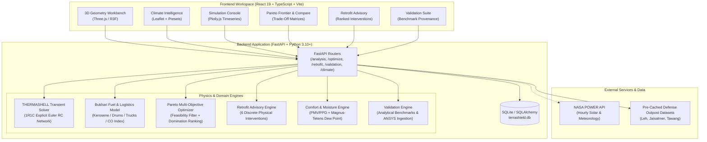
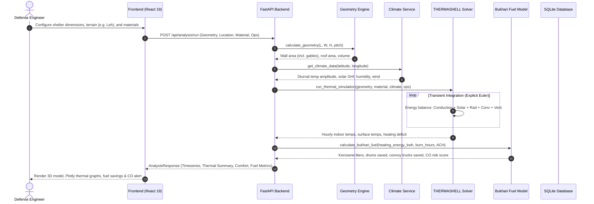
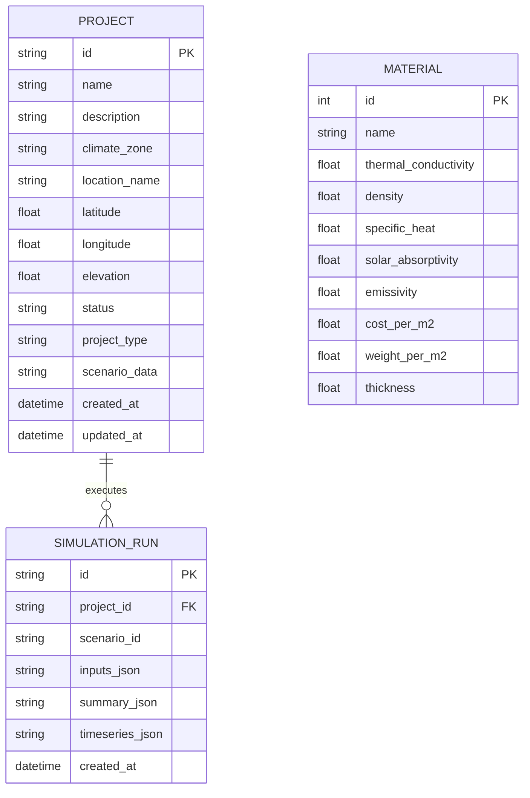

# TERRA-SHIELD

**Transient Thermal Simulation, Envelope Optimization, and Military Logistics Modeling for Extreme-Climate Defense Shelters**

TERRA-SHIELD is an integrated physics simulation, parametric optimization, and retrofit advisory platform engineered for extreme-climate military outposts and high-altitude defense infrastructure (e.g., Siachen, Leh/Ladakh, Tawang, and the Thar Desert). Built around **THERMASHELL**—a pure-Python lumped-parameter Resistance-Capacitance (RC) transient thermal solver—the platform quantifies indoor operative temperatures, structural heat loss, heating loads, kerosene fuel burn for military Bukhari space heaters, convoy logistics risk, and carbon monoxide (CO) accumulation hazards.

The platform directly addresses the operational challenges outlined in Smart India Hackathon problem statement **SIH26051**: reducing fossil fuel dependence in extreme forward areas, eliminating deadly CO asphyxiation risks in sealed outposts, preventing interstitial condensation, and identifying cost-effective thermal retrofit interventions for existing legacy infrastructure.

---

## Overview

High-altitude forward operating bases face extreme diurnal temperature swings (-40°C to +10°C in Ladakh), high solar irradiance, and severe logistics bottlenecks. Traditional structural analysis tools either rely on slow 3D finite element/CFD analysis that cannot be run interactively in the field, or oversimplified steady-state U-value calculations that ignore thermal mass, phase lag, solar radiation, and infiltration dynamics.

TERRA-SHIELD bridges this gap with a three-tier architecture:

1. **Transient Lumped-Parameter RC Solver (`thermashell_engine`)**: Solves coupled transient differential energy balance equations using explicit numerical integration, modeling envelope conduction, interior natural convection, exterior wind-driven convection, Stefan-Boltzmann longwave sky radiation, directional solar radiation on tilted surfaces, and sensible ventilation losses.
2. **Operational Logistics & Hazard Engine (`fuel_model.py`)**: Translates kilowatt-hours of deficit heating into liters of kerosene/ATF, calculates 200L standard military fuel drums and 5,000L convoy truck runs saved, and computes an operational Carbon Monoxide (CO) risk index based on hourly combustion rates versus room ventilation rate (Air Changes per Hour, ACH).
3. **Multi-Objective Pareto Optimizer & Retrofit Advisor (`optimizer.py`, `retrofit_engine.py`)**: Runs parallel parametric sweeps across material libraries, insulation thicknesses, and roof geometries, discarding thermally infeasible configurations, calculating non-dominated Pareto frontiers across comfort, fuel, weight, and capital expenditure, and flagging tactical airlift limits, flammability hazards, and condensation risks.



---

## Features

### 1. Core Thermal Simulation Engine
* **Transient 1R1C RC Network**: Explicit Euler integration tracking indoor air temperature, multi-layer wall interface temperatures, and roof thermal response over configurable 24- to 168-hour simulation horizons.
* **ISO 6946 Envelope Conduction**: Multi-layer wall and roof assemblies with composite thermal resistance ($R$-value) and overall heat transfer coefficients ($U$-value).
* **Dynamic Boundary Conditions**: Diurnal sinusoidal ambient temperature cycling with verified dawn-minimum and afternoon-peak phasing ($T_{\text{ambient}}(t) = T_{\text{mean}} + \Delta T \cdot \sin(2\pi t / 24 - \pi / 2)$).
* **Diurnal Solar Irradiance**: Time-dependent solar radiation model with half-sine daytime distribution ($6:00\text{ AM} - 6:00\text{ PM}$) and zero night radiation.
* **Stefan-Boltzmann Longwave Radiation**: Radiation heat exchange between building envelope surfaces and the sky dome using the Swinbank sky temperature formulation ($T_{\text{sky}} = 0.0552 \cdot T_{\text{air}}^{1.5}$).
* **Convective Coupling**: Combined interior natural convection (temperature-difference driven) and exterior forced convection parameterized by local wind velocity ($h_c = 4.0 + 4.0 \cdot v_{\text{wind}}$).
* **Infiltration & Ventilation**: Sensible heat transfer driven by room volume and air exchange rate (ACH).
* **Internal Metabolic Heat Gains**: Occupant sensible heat generation ($50\text{--}120\text{ W}$ per occupant).

### 2. Bukhari Space Heating & Military Logistics Engine
* **Fuel Conversion Physics**: Models Aviation Turbine Fuel / Kerosene (ATF/K-50) at $10.0\text{ kWh/L}$ lower heating value (LHV) with a $60\%$ thermal efficiency benchmark (modeled after DRDO Him-Tapak space heaters), yielding $6.0\text{ kWh/L}$ effective heat delivered.
* **Convoy & Drum Logistics**: Computes real-world military supply-chain impacts:
  * Number of standard Indian Army $200\text{L}$ fuel drums saved.
  * Number of $5,000\text{L}$ high-altitude convoy truck missions saved (ALS 2.5T / 5T platforms).
  * Direct seasonal operational fuel cost savings (benchmarked at $\text{₹}85/\text{L}$ delivered remote border cost).
* **Operational Carbon Monoxide (CO) Hazard Index**: A quantitative $0\text{--}100$ operational safety indicator derived from hourly kerosene combustion rate normalized against shelter ventilation volume ($\text{ACH}$):
  * **$0\text{--}29$ (Low)**: Negligible combustion accumulation; passive or baseline ventilation adequate.
  * **$30\text{--}59$ (Moderate)**: Standard Bukhari operation; periodic flue checks required.
  * **$60\text{--}79$ (High)**: Substantial combustion load; mandatory dual CO monitors and chimney draft verification.
  * **$80\text{--}100$ (Critical)**: High combustion load in restricted airflow; extreme backblast and asphyxiation hazard.

### 3. Moisture & Condensation Detection
* **Magnus-Tetens Dew Point Formulation**: Computes indoor dew point temperature based on indoor air temperature and relative humidity:
  $$\alpha(T, RH) = \frac{17.27 \cdot T}{237.7 + T} + \ln\left(\frac{RH}{100}\right), \quad T_{\text{dew}} = \frac{237.7 \cdot \alpha}{17.27 - \alpha}$$
* **Interstitial / Surface Condensation Hazard**: Dynamically flags configurations where the minimum inner wall or roof surface temperature drops below $T_{\text{dew}}$, preventing structural mold growth and thermal insulation degradation.

### 4. Multi-Objective Deterministic Pareto Optimizer
* **Permutation Sweep**: Full grid search across user-selected materials (Insulated Fabric, PU Foam, Rock Wool, Fiberglass, Aluminium, Concrete), insulation thicknesses ($0.05\text{--}0.20\text{ m}$), and roof pitches ($5^\circ\text{--}30^\circ$).
* **Feasibility Boundary**: Hard rejection of design candidates failing minimum thermal comfort criteria ($\text{Comfort \%} < \text{threshold}$, default $60\%$).
* **Non-Dominated Pareto Frontier**: Mathematical Pareto sorting evaluating solutions across four competing objective dimensions:
  1. Thermal Comfort Percentage ($\uparrow$ maximize)
  2. Fuel Consumption / Energy Loss ($\downarrow$ minimize)
  3. Total Structural Weight ($\downarrow$ minimize)
  4. Total Envelope Material Cost ($\downarrow$ minimize)
* **Risk & Tactical Flagging**:
  * **Flammability Risk**: Automatically flags Polyurethane (PU) Foam configurations due to toxic cyanide/smoke emission in field fire scenarios.
  * **Rapid Tactical Airlift Limit**: Flags configurations exceeding $2,000\text{ kg}$ total weight (beyond Mi-17 / ALH tactical heli-drop payloads).
  * **CO Hazard & Condensation**: Flags configurations with $\text{CO Risk} \ge 60$ or active condensation risk.

### 5. Retrofit Advisory Engine
* **Targeted Interventions**: Evaluates baseline uninsulated or poorly performing stone/masonry shelters against six discrete physical upgrade packages:
  1. *Airtightness & Weatherstripping Package* (EPDM gaskets, silicone caulking; reduces ACH by $65\%$)
  2. *50mm Exterior EPS Insulation* ($k = 0.036\text{ W/m}\cdot\text{K}$)
  3. *100mm Exterior Mineral Rockwool* ($k = 0.034\text{ W/m}\cdot\text{K}$, A1 fire-rated)
  4. *Polycarbonate Secondary Storm Glazing* ($10\text{mm}$ multi-wall UV-stabilized panels)
  5. *South-Facing Solar Trombe Wall Glazing* ($65\%$ solar gain boost via thermal storage mass)
  6. *Deep Thermal Overhaul* (Combined Rockwool, storm glazing, and precision sealing)
* **Economic Payback**: Computes capital expenditure ($\text{₹}$), thermal comfort gain ($\Delta\%$), seasonal fuel saved ($\text{L}$), and simple economic payback period in years.

### 6. Climate Intelligence & Offline Resilience
* **Live NASA POWER API**: Ingestion of hourly meteorological and solar parameters (`T2M`, `ALLSKY_SFC_SW_DWN`, `RH2M`, `WS10M`).
* **Deterministic Offline Fallbacks**: High-altitude defense outpost reference baselines embedded directly into the service for zero-connectivity field operation:
  * **Leh, Ladakh** (Cold-Arid, $34.15^\circ\text{N}, 77.58^\circ\text{E}$, $-10^\circ\text{C}$ baseline, $400\text{ W/m}^2$ solar)
  * **Jaisalmer, Rajasthan** (Hot-Arid Desert, $26.91^\circ\text{N}, 70.90^\circ\text{E}$, $+40^\circ\text{C}$ baseline, $800\text{ W/m}^2$ solar)
  * **Tawang, Arunachal Pradesh** (High-Altitude Humid Subtropical, $27.58^\circ\text{N}, 91.86^\circ\text{E}$, $+5^\circ\text{C}$ baseline, $85\%\text{ RH}$)

### 7. Transparent Validation Subsystem
* **Analytical Ground Truth**: Validates transient numerical solver against closed-form analytical solutions (Lumped Capacitance analytical heat balance from Incropera et al., *Fundamentals of Heat and Mass Transfer*).
* **Statistical Metrics**: Automated computation of Mean Absolute Error (MAE), Root Mean Square Error (RMSE), Pearson correlation coefficient ($r$), Coefficient of Determination ($R^2$), and Normalized RMSE (NRMSE).
* **Honest Provenance Architecture**: Ingestion pipeline in `backend/app/data/ansys_benchmarks/` ready to ingest raw ANSYS Fluent or Mechanical CSV export files. The platform explicitly reports test fixtures as `FIXTURE_ONLY` / `ANALYTICAL_REFERENCE` and never falsely claims verified ANSYS status without genuine FEA files.

---

## Technology Stack

| Layer | Technology | Version | Purpose |
| :--- | :--- | :--- | :--- |
| **Backend Runtime** | Python | `>= 3.10` | Physics simulation, scientific modeling, REST API |
| **Web Framework** | FastAPI | `^0.111.0` | Asynchronous high-performance REST API |
| **ASGI Server** | Uvicorn | `^0.30.0` | Production ASGI web server |
| **Data Validation** | Pydantic / Pydantic-Settings | `^2.7` / `^2.3` | Schema definition, type coercion, environment loading |
| **Database & ORM** | SQLite / SQLAlchemy | `^2.0.30` | Project metadata, simulation logs, material records |
| **Scientific Computing** | NumPy / Pandas | `^1.24` / `^2.0` | Vectorized transient integration, timeseries calculations |
| **Frontend Framework** | React | `^19.2.0` | Single-page application UI |
| **Frontend Tooling** | Vite | `^8.2.2` | Rapid build tooling and development server |
| **Type System** | TypeScript | `~6.0.2` | Compile-time type checking and interfaces |
| **Styling & Design** | Tailwind CSS | `^4.3.3` | Utility-first responsive design system |
| **3D Visualization** | Three.js / React Three Fiber | `^0.186` / `^9.7` | Interactive 3D shelter geometry and orientation viewport |
| **Scientific Charting** | Plotly.js / React-Plotly.js | `^4.1.0` | Timeseries graphs, heat balance breakdowns, Pareto scatter plots |
| **Geospatial Mapping** | Leaflet / React-Leaflet | `^1.9.4` / `^5.0` | Terrain coordinate picking and defense outpost location mapping |
| **State Management** | Zustand | `^5.0.15` | Centralized client-side simulation and scenario state |
| **Backend Testing** | Pytest / Pytest-Asyncio | `^9.1.1` / `^1.4` | Automated unit, physics, and integration test suite |

---

## Project Structure

```text
TERRA-SHIELD-BACKEND/
├── backend/
│   ├── app/
│   │   ├── api/
│   │   │   └── routes/
│   │   │       ├── analysis.py        # Thermal simulation endpoint (POST /api/analysis/run)
│   │   │       ├── climate.py         # NASA POWER & terrain retrieval (GET /api/climate)
│   │   │       ├── geometry.py        # Shelter geometry calculator (POST /api/geometry/calculate)
│   │   │       ├── materials.py       # Materials catalog (GET /api/materials)
│   │   │       ├── optimize.py        # Multi-objective Pareto optimization (POST /api/optimize)
│   │   │       ├── projects.py        # Project lifecycle CRUD (POST/GET /api/projects)
│   │   │       ├── retrofit.py        # Retrofit advisory engine (POST /api/retrofit/evaluate)
│   │   │       └── validation.py      # Benchmark suite & ANSYS status (/api/validation)
│   │   ├── config/
│   │   │   └── optimization_config.py # Scoring weights, norm bounds, and feasibility limits
│   │   ├── data/
│   │   │   ├── ansys_benchmarks/      # Benchmark manifest, case folders, and CSV datasets
│   │   │   └── materials.py           # Preloaded defense structural material properties
│   │   ├── db/
│   │   │   └── database.py            # SQLite engine and SQLAlchemy session factory
│   │   ├── models/
│   │   │   ├── analysis.py            # Simulation input/output Pydantic schemas
│   │   │   ├── climate.py             # Meteorological data schemas
│   │   │   ├── db_models.py           # SQLAlchemy tables (Project, MaterialDB, SimulationRunDB)
│   │   │   └── geometry.py            # Geometry input/output schemas
│   │   └── services/
│   │       ├── ansys_benchmark_service.py # Manifest discovery & dataset loading
│   │       ├── ansys_validation_engine.py  # Timeseries alignment & validation metrics
│   │       ├── climate_service.py     # NASA POWER client & cached terrain fallbacks
│   │       ├── comfort_engine.py      # PMV/PPD, comfort scoring, Magnus-Tetens dew point
│   │       ├── fuel_model.py          # Bukhari kerosene consumption & CO risk index
│   │       ├── geometry_engine.py     # Gable roof, pediment walls, and volume calculation
│   │       ├── optimizer.py           # Parallel grid search & Pareto dominance sorting
│   │       ├── retrofit_engine.py     # 6 discrete retrofit interventions & payback model
│   │       ├── thermal_engine.py      # Bridge between API schemas and RC network solver
│   │       └── validation_engine.py   # Analytical closed-form solutions (Incropera RC)
│   ├── tests/
│   │   ├── test_api.py                # End-to-end API route tests
│   │   ├── test_fuel_model.py         # Fuel calculations, convoy metrics, and CO hazard tests
│   │   ├── test_physics_fixes.py      # Geometry gable pediments, dew point, and diurnal cycle
│   │   ├── test_retrofit.py           # Retrofit evaluation and ranking tests
│   │   └── test_validation.py         # Benchmark integrity and provenance tests
│   ├── config.py                      # Global application settings (pydantic-settings)
│   ├── exceptions.py                  # Domain exception hierarchy
│   ├── main.py                        # FastAPI entrypoint, CORS configuration, and lifespan
│   └── requirements.txt               # Backend Python dependencies
├── frontend/
│   ├── src/
│   │   ├── components/
│   │   │   ├── layout/                # AppShell, Sidebar, PipelineBreadcrumb
│   │   │   └── TerrainJustificationModal.tsx # Defense shelter justification modal
│   │   ├── lib/
│   │   │   └── api.ts                 # Typed fetch client connecting to FastAPI
│   │   ├── pages/
│   │   │   ├── ClimateIntelligencePage.tsx # Map coordinate picker & climate telemetry
│   │   │   ├── ComparePage.tsx        # Multi-scenario dynamic comparison matrix
│   │   │   ├── EnvelopeBuilderPage.tsx # Multi-layer wall/roof assembly configurator
│   │   │   ├── GeometryWorkbenchPage.tsx # 3D Three.js interactive shelter visualizer
│   │   │   ├── HomePage.tsx           # Product overview and mission statement
│   │   │   ├── MaterialLibraryPage.tsx # Thermal material catalog & physical constants
│   │   │   ├── OperatingConditionsPage.tsx # Occupancy, metabolic gains, and ACH controls
│   │   │   ├── OptimizePage.tsx       # Pareto scatter chart, filter toggles, CSV export
│   │   │   ├── ProjectsPage.tsx       # Saved defense project management
│   │   │   ├── ReportPage.tsx         # Comprehensive engineering report generation
│   │   │   ├── ResultsPage.tsx        # Thermal profiles, fuel charts, and comfort status
│   │   │   ├── RetrofitPage.tsx       # Retrofit options, payback metrics, and savings
│   │   │   ├── SettingsPage.tsx       # Application preferences
│   │   │   ├── SimulationConsolePage.tsx # Execution trigger and parameters
│   │   │   └── ValidationPage.tsx     # Analytical validation & ANSYS provenance viewer
│   │   ├── stores/
│   │   │   └── appStore.ts            # Central Zustand state store
│   │   ├── App.tsx                    # React Router configuration
│   │   └── main.tsx                   # Client bootstrap
│   ├── package.json                   # Frontend dependencies and npm scripts
│   └── vite.config.ts                 # Vite build configuration
├── thermashell_engine/                # Standalone pure-Python thermal engineering library
│   ├── comfort.py                     # ISO 7730 PMV/PPD thermal sensation models
│   ├── conduction.py                  # Multi-layer U-values and thermal capacitance
│   ├── convection.py                  # Interior natural and exterior wind convection
│   ├── optimizer.py                   # Pure-Python optimization primitives
│   ├── pyproject.toml                 # Package definition for thermashell-engine
│   ├── radiation.py                   # Stefan-Boltzmann sky and surface radiation
│   ├── rc_network.py                  # 1R1C transient lumped-parameter solver
│   ├── solar.py                       # Solar angles, Perez diffuse model, and orientation
│   ├── types.py                       # Dataclasses and enums for thermal simulation
│   ├── ventilation.py                 # Infiltration sensible heat transfer
│   └── tests/                         # Engine-level unit tests
├── BUGS_AUDIT.md                      # Audit of historical bugs and physics corrections
├── FINAL_IMPLEMENTATION_AUDIT.md      # Verified compliance audit against SIH specifications
└── terrashield.db                     # Unified SQLite database
```

---

## Getting Started

### Prerequisites

* **Python**: Version `3.10` or higher (tested and verified on Python `3.14`).
* **Node.js**: Version `18.0.0` or higher (Node `20+` recommended).
* **Package Managers**: `pip` (Python) and `npm` (Node).

---

### Installation

1. **Clone the repository**:
   ```bash
   git clone https://github.com/SHAR102938/TERRA-SHIELD-BACKEND.git
   cd TERRA-SHIELD-BACKEND
   ```

2. **Set up the Python backend**:
   ```bash
   # Create and activate a virtual environment (optional but recommended)
   python -m venv .venv
   
   # Windows PowerShell:
   .venv\Scripts\Activate.ps1
   # Linux / macOS:
   source .venv/bin/activate

   # Install dependencies
   pip install -r backend/requirements.txt
   ```

3. **Set up the React frontend**:
   ```bash
   cd frontend
   npm install
   cd ..
   ```

---

### Environment Configuration

The application uses sane defaults for local development out of the box. To override defaults, create a `.env` file in the repository root or configure environment variables:

| Variable | Type | Default | Description |
| :--- | :--- | :--- | :--- |
| `APP_NAME` | string | `"TERRA-SHIELD"` | Application name displayed in API responses |
| `API_VERSION` | string | `"v1"` | API release version |
| `DEBUG` | boolean | `true` | Enables debug logging and verbose traces |
| `DATABASE_URL` | string | `"sqlite:///./terrashield.db"` | SQLAlchemy database connection URI |
| `CORS_ORIGINS` | list | `["http://localhost:5173", "http://localhost:3000", "http://127.0.0.1:5173"]` | Whitelisted browser client origins |
| `NASA_POWER_BASE_URL` | string | `"https://power.larc.nasa.gov/api/temporal/hourly/point"` | NASA meteorological endpoint |
| `NASA_POWER_CACHE_TTL_HOURS` | integer | `168` | Cache duration for downloaded climate data |
| `MAX_SIMULATION_HOURS` | integer | `8760` | Maximum allowable simulation time horizon |
| `SIMULATION_TIMEOUT_S` | integer | `300` | Process execution timeout in seconds |

> [!NOTE]
> No third-party API keys are strictly required to run TERRA-SHIELD. NASA POWER is an open public endpoint, and the backend automatically falls back to bundled defense outpost climate datasets (Leh, Jaisalmer, Tawang) if the external API is unreachable or offline.

---

### Running Locally

To run the full stack, start the backend and frontend in separate terminal windows:

#### Terminal 1 — Backend API
```powershell
# Windows PowerShell:
$env:PYTHONPATH=".;backend"
python -m uvicorn backend.main:app --reload --port 8000
```
```bash
# Linux / macOS:
PYTHONPATH=.:backend python -m uvicorn backend.main:app --reload --port 8000
```
* Interactive Swagger UI: [http://localhost:8000/docs](http://localhost:8000/docs)
* Health check: [http://localhost:8000/health](http://localhost:8000/health)

#### Terminal 2 — Frontend Client
```bash
cd frontend
npm run dev
```
* Web Application: [http://localhost:5173](http://localhost:5173)

---

### Building for Production

#### Backend
The backend runs directly via production ASGI runners:
```bash
python -m uvicorn backend.main:app --host 0.0.0.0 --port 8000 --workers 4
```

#### Frontend
Compile TypeScript and bundle client assets with Vite:
```bash
cd frontend
npm run build
```
Production assets are generated in `frontend/dist/`. To preview the production bundle locally:
```bash
npm run preview
```

---

### Testing

The test suite validates API endpoints, physics equations, logistics calculations, and benchmark integrity:

```powershell
# Windows PowerShell:
$env:PYTHONPATH=".;backend"
python -m pytest -v
```
```bash
# Linux / macOS:
PYTHONPATH=.:backend python -m pytest -v
```

**Test Coverage Summary (50 Passing Tests)**:
* `backend/tests/test_api.py`: Canonical REST endpoints (health, climate, materials, geometry, simulation, projects, optimization, retrofit).
* `backend/tests/test_fuel_model.py`: Bukhari fuel consumption, logistics savings, convoy drum counts, and 4-tier CO risk levels.
* `backend/tests/test_physics_fixes.py`: Gable wall area with triangular pediments, volume calculations, and Magnus-Tetens dew point condensation detection.
* `backend/tests/test_retrofit.py`: Retrofit evaluation, ranking, payback period computation, and output schema consistency.
* `backend/tests/test_validation.py`: Benchmark dataset discovery, time-series alignment, statistical metrics (MAE, RMSE, $R^2$), and honest provenance status.
* `thermashell_engine/tests/test_engine.py`: Unit tests for conduction, convection, radiation, solar angles, infiltration, and ISO 7730 PMV/PPD thermal sensation models.

---

## Application Flow



---

## API Reference

All endpoints accept and return JSON. The API root is mounted at `/api`.

| Method | Endpoint | Description | Request Body / Params |
| :--- | :--- | :--- | :--- |
| `GET` | `/health` | Service health status and API version | None |
| `POST` | `/api/geometry/calculate` | Computes wall area, roof slope, gable pediments, and interior volume | `{"length": 6.0, "width": 4.0, "height": 3.0, "roof_pitch": 15.0}` |
| `GET` | `/api/materials` | Lists all structural and insulation materials in the database | None |
| `GET` | `/api/materials/{id}` | Fetches physical and thermal properties of a specific material | Path parameter `id` (integer) |
| `GET` | `/api/climate` | Fetches NASA POWER hourly climate data or cached defense baseline | Query params `latitude`, `longitude` |
| `POST` | `/api/analysis/run` | Executes transient thermal simulation and Bukhari fuel model | `AnalysisInput` (Geometry, Material ID, Location, Simulation, Ops) |
| `POST` | `/api/optimize` | Runs parallel multi-objective optimization across candidate parameter grid | `OptimizeRequest` (Ranges, Target, Weights, Comfort band) |
| `POST` | `/api/retrofit/evaluate` | Evaluates discrete physical retrofit interventions against an existing baseline | `RetrofitRequest` (Geometry, Location, Ops, Baseline material) |
| `POST` | `/api/projects` | Creates and persists a defense shelter project record | `ProjectCreate` (ID, Name, Coordinates, Scenario JSON) |
| `GET` | `/api/projects` | Retrieves list of all persisted defense projects | None |
| `GET` | `/api/projects/{id}` | Retrieves details and scenario state of a specific project | Path parameter `id` (string) |
| `GET` | `/api/validation/benchmarks` | Lists all available analytical and experimental validation benchmarks | None |
| `GET` | `/api/validation/ansys-status`| Reports dataset provenance and status of external ANSYS integration | None |
| `POST` | `/api/validation/run` | Executes validation benchmark comparison against authoritative references | `{"case_id": "ansys_case_a"}` |

---

## Mathematical & Physics Foundations

### 1. Transient Lumped-Parameter RC Energy Balance
The temperature change of the indoor air thermal node over timestep $\Delta t$ is governed by the conservation of thermal energy:

$$C_{\text{eff}} \frac{dT_{\text{in}}}{dt} = \sum Q_{\text{conduction}} + Q_{\text{solar}} + Q_{\text{internal}} - Q_{\text{ventilation}} + Q_{\text{hvac}}$$

Where:
* $C_{\text{eff}} = \rho_{\text{air}} c_{p,\text{air}} V + 0.5 \sum (A_i d_i \rho_i c_{p,i})$ is the effective lumped thermal capacitance ($\text{J/K}$).
* $Q_{\text{conduction}} = \sum U_i A_i (T_{\text{ext}} - T_{\text{in}})$ is the envelope conduction through walls, roof, and floor ($\text{W}$).
* $Q_{\text{ventilation}} = \frac{\text{ACH} \cdot V}{3600} \cdot \rho_{\text{air}} c_{p,\text{air}} (T_{\text{in}} - T_{\text{out}})$ represents sensible infiltration and ventilation heat loss ($\text{W}$).
* $Q_{\text{solar}} = \sum A_i \cdot \alpha_i \cdot I_{\text{solar}}(t)$ represents absorbed solar irradiance ($\text{W}$).

### 2. Envelope U-Value Calculation (ISO 6946)
For an assembly with $n$ material layers:

$$R_{\text{total}} = R_{si} + \sum_{j=1}^{n} \frac{d_j}{k_j} + R_{se}, \quad U = \frac{1}{R_{\text{total}}}$$

Where $R_{si} = 0.13\text{ m}^2\text{K/W}$ and $R_{se} = 0.04\text{ m}^2\text{K/W}$ are interior and exterior surface boundary film resistances, $d_j$ is layer thickness ($\text{m}$), and $k_j$ is thermal conductivity ($\text{W/m}\cdot\text{K}$).

### 3. Bukhari Fuel & Convoy Logistics Model
Given the net heating energy required to maintain indoor target temperature ($E_{\text{heat}}$ in $\text{kWh}$):

$$\text{Fuel}_{\text{liters}} = \frac{E_{\text{heat}}}{\eta_{\text{bukhari}} \cdot \text{LHV}_{\text{kerosene}}} = \frac{E_{\text{heat}}}{0.60 \times 10.0\text{ kWh/L}} = \frac{E_{\text{heat}}}{6.0}$$

$$\text{Drums}_{\text{saved}} = \frac{\text{Fuel}_{\text{saved, liters}}}{200\text{ L}}, \quad \text{Trucks}_{\text{saved}} = \frac{\text{Fuel}_{\text{saved, liters}}}{5000\text{ L}}$$

### 4. Operational Carbon Monoxide (CO) Risk Score
The operational safety index accounts for combustion intensity relative to dilution ventilation:

$$\text{CO Index} = \min\left(100.0, \max\left(5.0, \left(\frac{\text{Fuel}_{\text{liters}} / t_{\text{hours}}}{\max(0.2, \text{ACH})}\right) \times 35.0\right)\right)$$

---

## Database Architecture

The persistence layer uses SQLite via SQLAlchemy. The database file `terrashield.db` is automatically created on startup via the FastAPI lifespan hook.



---

## Security & Operational Safety

* **Zero Hardcoded Secrets**: Application secrets, environment configurations, and database connection strings are managed strictly via environment variables (`pydantic-settings`).
* **Origin Whitelisting (CORS)**: Cross-Origin Resource Sharing is locked to configured client origins (`CORS_ORIGINS`). Wildcard origins (`"*"`) with credential support are strictly disabled.
* **Input Validation**: All incoming requests are validated against strict Pydantic v2 schemas on the backend and Zod schemas on the frontend, rejecting negative dimensions, invalid coordinates (latitude $\notin [-90, 90]$, longitude $\notin [-180, 180]$), and out-of-range simulation parameters.
* **Local Execution Boundary**: Simulations run strictly on local CPU within the process boundary without executing arbitrary system commands or subshells.

---

## Known Limitations & Engineering Boundaries

To uphold technical integrity, the following boundaries of the current implementation are explicitly documented:

1. **Reduced-Order RC Solver vs. Spatial 3D CFD**:
   The transient solver models each building envelope element as a lumped thermal node. It is optimized for rapid multi-parameter optimization ($<2\text{ seconds}$ for 72 design permutations). It does not compute spatial Navier-Stokes velocity or temperature gradients within the room volume.
2. **CO Hazard Index vs. Blood Carboxyhemoglobin**:
   The CO risk score ($0\text{--}100$) is an **operational risk indicator** reflecting the ratio of fuel burn rate to dilution air changes. It is not a clinical pharmacokinetic model of blood carboxyhemoglobin percentage ($\%HbCO$).
3. **Moisture Screening vs. Hygrothermal FEA**:
   Condensation risk is computed using the Magnus-Tetens dew point equation comparing indoor dew point to minimum inner wall/roof surface temperature. Detailed multi-year hygrothermal moisture migration through porous wall membranes (e.g., standard WUFI simulation) is not currently implemented.
4. **ANSYS Validation Provenance**:
   The validation subsystem currently evaluates the engine against analytical closed-form transient solutions (Incropera Lumped Capacitance equations). These datasets are explicitly marked as `FIXTURE_ONLY` in metadata. The platform is architected to ingest real ANSYS Fluent / Mechanical CSV exports into `backend/app/data/ansys_benchmarks/` when genuine FEA simulation runs become available.

---

## Troubleshooting

### 1. `ModuleNotFoundError: No module named 'thermashell_engine'` or `'config'`
**Cause**: Python path does not include the project root or backend directories.  
**Resolution**: Set `PYTHONPATH` before launching the server:
```powershell
# Windows PowerShell:
$env:PYTHONPATH=".;backend"
python -m uvicorn backend.main:app --reload --port 8000
```
```bash
# Linux / macOS:
PYTHONPATH=.:backend python -m uvicorn backend.main:app --reload --port 8000
```

### 2. Frontend Network Error / CORS Rejection
**Cause**: The frontend is running on a port not included in `CORS_ORIGINS`.  
**Resolution**: Check the terminal where Vite launched (e.g., `http://localhost:5173`). Verify that `backend/config.py` contains your origin in `CORS_ORIGINS`, or supply `CORS_ORIGINS='["http://localhost:5173"]'` in your `.env` file.

### 3. NASA POWER API Timeout
**Cause**: Remote NASA server latency or lack of internet connectivity.  
**Resolution**: The backend automatically falls back to pre-cached datasets (Leh, Jaisalmer, Tawang). No manual intervention is needed. For custom coordinates when offline, the system defaults gracefully to high-altitude defense reference conditions.

---

## License

No license has been specified for this repository. All rights are reserved by the original authors and contributing organizations. For academic, defense, or commercial use, contact the repository maintainers.
