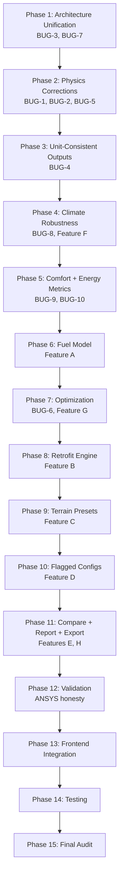

# TERRA-SHIELD Implementation Plan

> [!IMPORTANT]
> This plan was generated after a deep inspection of the entire repository. It covers all bugs from the fix.md instructions and all SIH-promised features.

---

## A. Current Architecture

### How Frontend Talks to Backend

The frontend (`Vite + React + Zustand`) talks to **two separate FastAPI backends** simultaneously:

1. **`backend/app/main.py`** — "Classic" API at `/api/{resource}` (geometry, materials, climate, analysis, projects, optimize, validation)
2. **`backend/main.py`** — "V1" API at `/api/v1/{resource}` (climate, materials, simulations, projects, optimization, validation)

The frontend's `api.ts` uses `http://localhost:8000` and hits `/api/analysis/run`, `/api/materials`, `/api/geometry/calculate`, `/api/optimize`, `/api/climate`, `/api/projects` — all **classic** routes.

**Critical Problem**: The `app/main.py` ALSO mounts the v1 router, creating duplicate routes. The `backend/main.py` is an independent entry point.

### Backend Entrypoints
| File | Routes | CORS Bug |
|---|---|---|
| `backend/main.py` | `/api/v1/*`, `/health` | Uses `settings.CORS_ORIGINS` (safe) |
| `backend/app/main.py` | `/api/*`, `/api/v1/*` (try/except) | `allow_origins=["*"]` + `allow_credentials=True` ❌ |

### Simulation Flow
1. Frontend calls `/api/analysis/run` with `AnalysisInput`
2. `analysis.py` route calls `calculate_geometry()` → `get_climate_data()` → `run_thermal_simulation()` → `summarize_simulation_results()` → `calculate_comfort_score()`
3. Results return as flat `AnalysisResponse`

**Two separate thermal engines exist**:
- `backend/app/services/thermal_engine.py` — Simple single-material model used by classic routes
- `thermashell_engine/rc_network.py` — More advanced multi-layer RC model used by v1 routes

### Climate Data
- `backend/app/services/climate_service.py` — Direct NASA POWER call, no caching, no fallback
- `backend/services/climate_service.py` — SQLite-cached, rate-limited, demo fallback (Leh only)

### Optimization
- `backend/app/services/optimizer.py` — Grid search over materials × thicknesses × roof pitches, uses simple thermal engine
- `thermashell_engine/optimizer.py` — Parametric sweep over insulation × windows × ACH, uses RC network, has Pareto frontier

### Validation
- `backend/app/services/validation_engine.py` — Analytical steady-state + transient RC references
- `backend/app/services/ansys_validation_engine.py` — Full validation pipeline with time alignment and metrics
- `backend/app/services/ansys_benchmark_service.py` — Repository for benchmark datasets

---

## B. Audit Status Table

| ID | Issue/Feature | Current Status | Root Cause | Required Fix |
|---|---|---|---|---|
| BUG-1 | Time-dependent solar radiation | **PARTIALLY FIXED** | `app/services/thermal_engine.py` uses static `solar_radiation` constant. `thermashell_engine/rc_network.py` uses proper hourly GHI with solar position model. | Unify on the v1 engine's solar model. The classic engine must be replaced or upgraded. |
| BUG-2 | Outdoor temperature phase | **PARTIALLY FIXED** | Classic engine uses `sin(2πt/24)` → peak at 6h. V1 engine uses `sin(2πh/24 - π/2)` → peak at ~15h. | Classic engine has the bug. V1 engine correctly shifts phase. Unify on v1 engine. |
| BUG-3 | CORS startup | **OPEN** | `app/main.py` line 39: `allow_origins=["*"]` + `allow_credentials=True`. Invalid per CORS spec. | Fix to use explicit origins list. |
| BUG-4 | Power vs Energy | **PARTIALLY FIXED** | Classic `thermal_engine.py` `summarize_simulation_results()` sums instantaneous W values as if they were energy. V1 `rc_network.py` correctly multiplies by `dt_s/3600` for Wh→kWh conversion. Frontend `appStore.ts` divides by 1000 on already-W values for "kwh". | Unify on v1 engine. Fix frontend mapping. |
| BUG-5 | Gable wall geometry | **PARTIALLY FIXED** | `geometry_engine.py` computes rectangular wall area only; triangular gable pediments not included. `ShelterGeometry` in types.py also excludes gable area. | Add triangular gable end areas to wall calculation in `geometry_engine.py`. |
| BUG-6 | Optimizer normalization | **OPEN** | `NORM_RANGES` has `energy_loss_max=250_000` "for 72h". Different durations will break normalization. | Make normalization duration-aware. |
| BUG-7 | Dual entrypoints | **OPEN** | Two separate `main.py` files, duplicate routes, frontend uses classic routes that use the buggy thermal engine. | Unify to single entrypoint. Route frontend through v1 API. |
| BUG-8 | Climate offline failure | **PARTIALLY FIXED** | `app/services/climate_service.py` has no fallback. `services/climate_service.py` has Leh fallback only. | Implement multi-location cached climate datasets. |
| BUG-9 | Frontend hardcoded zeros | **OPEN** | `appStore.ts` lines 328-353: `q_conduction_roof: 0`, `pmv_mean: 0`, `ppd_mean: 0`, `peak_heating_load_w: 0`, `hours_below_comfort: 0`, `hours_above_comfort: 0`. | Map real backend results. Requires switching to v1 engine API which returns these. |
| BUG-10 | Mock/demo data leakage | **OPEN** | `generateDemoResults()` at line 378, used as fallback when no scenario data is provided. Hardcoded heat_balance values, PMV values, comfort stats. | Remove `generateDemoResults()` from normal flow. Make demo mode explicit. |

---

## C. SIH Requirements Matrix

| Capability | Existing Implementation | Missing Implementation |
|---|---|---|
| Terrain-specific presets | Leh + Jaisalmer presets in `appStore.ts`. Tawang preset in v1 `projects.py`. | **Tawang preset NOT in frontend**. No moisture/dew-point risk. |
| Physics-based thermal simulation | Two engines — classic (buggy) and v1 (better). | Classic engine used by frontend has bugs 1,2,4. |
| Transient model | Both engines are transient. V1 is proper RC network. | Frontend uses classic engine. |
| Optimization | Both optimizers exist. | Frontend uses classic optimizer. V1 optimizer has Pareto but no weight/fuel objectives. |
| Comfort vs fuel vs weight vs cost | Classic optimizer has 4 objectives. V1 has 3 (energy/comfort/cost). | **No fuel model at all**. Weight only in classic optimizer. |
| ANSYS validation | Full pipeline exists with test fixtures. | **No real ANSYS data** — all fixtures. Correctly labeled. |
| Offline climate reliability | V1 has Leh fallback. | **Only Leh**. No Jaisalmer/Tawang cached data. |
| Retrofit workflow | **NOT IMPLEMENTED** | Need full retrofit mode. |
| Flagged trade-offs | Binary feasible/infeasible only. | Need Flagged/Borderline state. |
| Terrain justification sheet | **NOT IMPLEMENTED** | Need dynamic justification document. |
| Ranked config report | Optimizer returns ranked list. | No export capability. |
| Compare workflow | **Hardcoded** `VARIANTS` in `ComparePage.tsx`. | Need dynamic comparison. |
| Export capability | **NOT IMPLEMENTED** | Need CSV/report export. |
| Bukhari/fuel savings | **NOT IMPLEMENTED** | Need fuel consumption model. |
| North-East terrain | Tawang preset exists in v1 `projects.py`. | Not in frontend. No moisture/condensation logic. |

---

## D. Dependency Graph

---

## E. File-Level Change Plan

### Files to Modify
| File | Changes |
|---|---|
| `backend/app/main.py` | **DELETE** — unify entrypoint |
| `backend/main.py` | Merge all classic routes, fix CORS |
| `backend/app/services/thermal_engine.py` | Replace with bridge to `thermashell_engine` |
| `backend/app/services/geometry_engine.py` | Add gable wall areas |
| `backend/app/services/climate_service.py` | Add fallback provider |
| `backend/app/services/optimizer.py` | Duration-aware normalization, fuel/weight objectives, Pareto |
| `backend/app/services/comfort_engine.py` | Bridge to `thermashell_engine/comfort.py` |
| `backend/app/config/optimization_config.py` | Duration-aware ranges |
| `frontend/src/stores/appStore.ts` | Remove `generateDemoResults`, fix result mapping |
| `frontend/src/lib/api.ts` | Update API URLs for unified backend |
| `frontend/src/pages/ComparePage.tsx` | Dynamic comparison from results |
| `frontend/src/pages/OptimizePage.tsx` | Add fuel/weight display, Pareto viz |
| `frontend/src/pages/ResultsPage.tsx` | Fix zero values, add real metrics |
| `frontend/src/pages/ReportPage.tsx` | Add export, justification |

### Files to Create
| File | Purpose |
|---|---|
| `backend/app/services/fuel_model.py` | Bukhari/kerosene fuel consumption |
| `backend/app/services/retrofit_engine.py` | Retrofit intervention generator |
| `backend/app/services/terrain_presets.py` | Centralized terrain preset data |
| `backend/app/data/climate_cache/` | Pre-cached climate datasets |
| `backend/app/services/moisture_risk.py` | Dew-point/condensation screening |
| `backend/api/v1/retrofit.py` | Retrofit API endpoint |
| `backend/api/v1/export.py` | CSV/report export endpoint |
| `backend/tests/test_thermal_physics.py` | Physics bug tests |
| `backend/tests/test_geometry.py` | Geometry tests |
| `backend/tests/test_fuel_model.py` | Fuel model tests |
| `backend/tests/test_optimizer.py` | Optimizer tests |
| `backend/tests/test_climate_fallback.py` | Climate fallback tests |

---

## F. Risks

| Risk | Severity | Mitigation |
|---|---|---|
| Breaking existing frontend by changing API routes | High | Keep classic routes as compatibility shim initially |
| Physics regressions when switching engines | High | Run validation benchmarks before and after |
| Numerical instability with gable geometry changes | Medium | Validate with analytical test cases |
| Performance degradation with fuel model in optimizer | Medium | Cache climate data, limit candidate count |
| Frontend regression from removing demo data | High | Ensure backend returns complete data before removing fallback |
| Offline demo breaking with new climate provider | Medium | Test all three cached terrains |

---

> [!TIP]
> This plan should be executed in the dependency order shown in the graph. Each phase should be tested before moving to the next.
